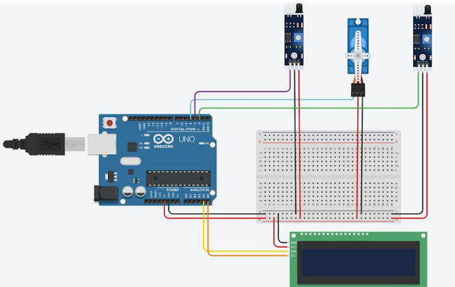

# Arduino Smart Parking System

## Overview

This project is a Smart Parking System developed using Arduino UNO, Ultrasonic Sensors, a Servo Motor, and an I2C LCD Display. The system automatically detects vehicles, controls the entry gate, and monitors parking slot availability in real time.

The project demonstrates automation, sensor interfacing, and embedded systems programming using Arduino.

---

## Features

* Automatic vehicle detection
* Servo-controlled parking gate
* Real-time parking slot monitoring
* LCD display for slot status
* Fully automated parking management

---

## Components Used

* Arduino UNO
* HC-SR04 Ultrasonic Sensors
* Servo Motor
* I2C LCD Display (16x2)
* Jumper Wires
* Breadboard

---

## Applications

* Smart Parking Areas
* Shopping Malls
* Office Buildings
* Residential Complexes
* Automated Vehicle Entry Systems

---

## Technologies Used

* Arduino IDE
* Embedded C/C++
* Ultrasonic Sensing
* Servo Motor Control
* LCD Interfacing

---

## Circuit Diagram

## Demo Video

Uploading smartparking-zt01ax9e-r6rhl3ym_3KT39Qve-compressed.mp4…

## Author

Sauhard Agnihotri
